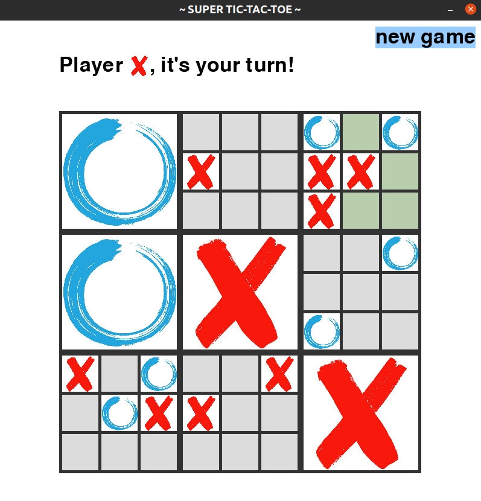
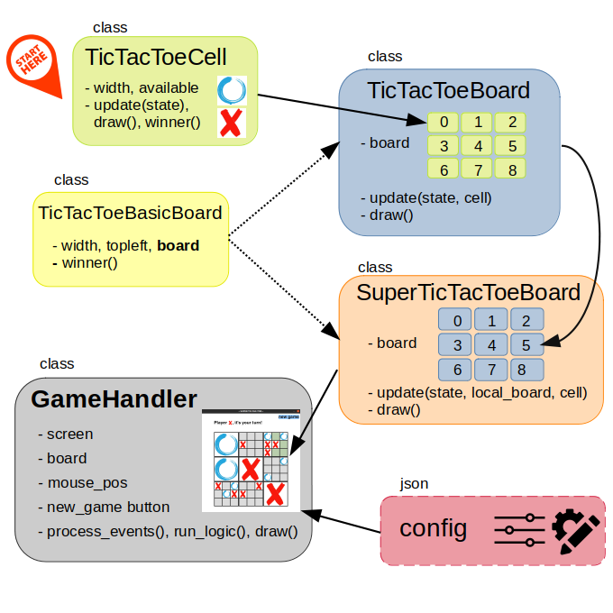

# Super Tic-Tac-Toe Game
The aim of this project is to develop the Python code to play the [Super Tic Tac Toe Game](https://en.wikipedia.org/wiki/Ultimate_tic-tac-toe). 
It uses the [Pygame](https://www.pygame.org/docs/) module, and allows the players to customize the game.


## Game Rules

This board game is composed of nine Tic-Tac-Toc boards arranged in a 3x3 grid. Players take
turns playing on the smaller boards until one of them wins on the larger board. The players will interact with the game through the computer
mouse and a simple but beautiful interface (created using pygame) that will display the big board and the game’s information and instructions.

Before going into greater detail with regard to the Super Tic-Tac-Toe game logic, let us first
explain how the common Tic-Tac-Toe game works. There are two players who take turns
marking the spaces in a 3x3 grid with (typically) *X* and *O*. The first player who succeeds in
placing three of their marks in horizontal, vertical, or diagonal row is the winner.

If played optimally by both players, the Tic-Tac-Toe game always ends in a draw. So, in order
to make the game more challenging, several variations have been created. The focus of this
project is on the Super Tic-Tac-Toe variation. Here we have a 3x3 grid of *local boards* and the
larger 3x3 board is referred to as the *global board*. If a move is played so that it is to win a
local board by the rules of normal tic-tac-toe, then the entire local board is marked as a
victory for the player in the global board. If there is a local draw, that local board is emptied so
it can be played again.

The game starts with *X* (or *O*) playing wherever they want in any of the 81 empty spots. This move
*"sends"* their opponent to its relative location. For example, if *X* played in the top right square
of their local board, then *O* needs to play next in any one of the nine available spots in the
local board at the top right of the global board.

Super Tic-Tac-Toe is significantly more complex than most other variations of Tic-Tac-Toe, as
there is no clear strategy to play it. This is because of its complicated game branching.
Even though every move must be played in a local board, the players must take into
account the global board in several ways (anticipating the next move, visualizing the game
tree, and winning in the global board).

## Code
The code has been organized following the *Object-oriented programming (OOP)* paradigm.
The logic of the game is split into five classes that can be found in the ```classes``` directory. Each one implements a different concept and
might use or depend on other ones. The following figure shows the dependencies and
the hierarchy of the classes. In the next paragraphs, each module will be explained in more detail.



**TicTacToeCell:** implements the behaviour of a Cell in a Tic-Tac-Toe board. The state of a cell
can be unfilled (not chosen yet), available (if it is unfilled and is allowed to be chosen by the
active player in current turn), or filled by either player1 or player2. The ```update``` method allows
to change the cell state. The ```draw``` mehod displays a {*width*}x{*width*} square taking into account the cell state.

**TicTacToeBasicBoard:** implements the basic functionalities that both local and global boards share in a
Super Tic-Tac-Toe game. It serves as a *Parent Class* for the TicTacToeBoard and
SuperTicTacToeBoard classes. The main methods here is ```winner```, which returns the winner of the
game if any (or if the game is a draw). The winner method is implemented following a simple
recursive approach which is based on the fact that *a cell is to a local board as a local board
is to a global board*. This way we can call this method from the global board and triggers that same method
through different layers of the game’s logic.

**TicTacToeBoard:** implements the behaviour of a local board in a Super Tic-Tac-Toe game
(equivalent to the main board in a common Tic-Tac-Toe game). It inherits some
functionalities from its parent class ```TicTacToeBasicBoard```. The ```board``` attribute in a local board is
composed of nine ```TicTacToeCell``` instances arranged in a 3x3 grid. The ```update``` method allows to update
the availability of the local board or the winner of a given cell. When a local board has a winner, 
from a global board perspective it is regarded as a (big) cell, not a local board anymore. The ```draw``` method 
displays all the cells in the local board. But if there is a local winner, it plays the role of a Cell. 

**SuperTicTacToeBoard:** implements the behaviour of a global board in a Super Tic-Tac-Toe
game. It inherits some functionalities from its parent class ```TicTacToeBasicBoard```. The ```board``` attribute
in a global board is composed of nine ```TicTacToeBoard``` instances arranged in a 3x3 grid.
The ```update``` method allows to update the availability of a given local board, or the winner of a given cell. 
The ```draw``` method displays all the local boards in the global board.

**GameHandler**: implements the main flow of the game. There are four main methods: ```process_events``` to capture mouse clicks,
```run_logic``` to process the turns taken by the players, ```draw``` to display the game elements (board + game information + new_game button).
Finally, the ```run``` method gathers everything and runs the main loop.

**config:** *json* file that allows the players to customize their game without
having to change the anything in the code. A comprehensive explanation about the
customization can be found in a subsequent section.

## Running The Game
In the ```scripts``` directory there is a file named ```game_runner.py```.
Run this file in order to play the game. Basically, it initializes a ```GameHandler``` instance
and calls its ```run``` method.

## Customizing Your Game

## Future Work